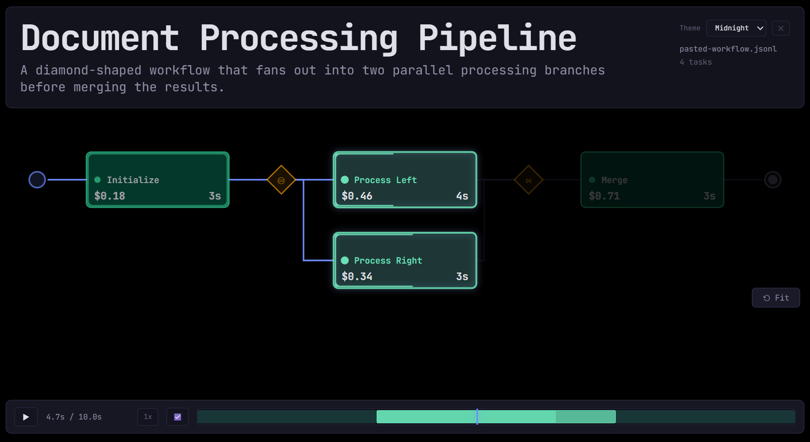

# Visualizer

CLI tool that reads a workflow execution log (JSONL) and generates a **self-contained interactive HTML report**. The report renders a directed acyclic graph (DAG) that automatically forks when tasks execute in parallel and joins when they converge — plus a scrubable playback timeline.

Built with Vue 3, Vite, and [ELKjs](https://github.com/kieler/elkjs) for automatic graph layout.

## Quick Start

```bash
npm install
npm run build
node bin/taskviz.js samples/ci-pipeline.jsonl
```

This produces a single HTML file (default: `ci-pipeline.html`) and opens it in your browser. The report is entirely self-contained — no server needed.

## Usage

```
taskviz <logfile.jsonl> [-o output.html] [--no-open]
```

| Flag | Description |
|------|-------------|
| `-o <file>` | Output HTML file path (default: `<logfile>.html`) |
| `--no-open` | Don't open the report in a browser |
| `-h, --help` | Show help |

### Examples

```bash
# Generate and open a report
node bin/taskviz.js my-workflow.jsonl

# Write to a specific path without opening
node bin/taskviz.js my-workflow.jsonl -o reports/run-42.html --no-open

# Batch-generate reports for all samples
for f in samples/*.jsonl; do node bin/taskviz.js "$f" -o "out/$(basename "$f" .jsonl).html" --no-open; done
```

## JSONL Schema

An optional **workflow header** may appear as the first line of the JSONL file to describe the overall run:

| Field | Type | Required | Description |
|-------|------|----------|-------------|
| `title` | `string` | | Large report title shown at the top of the loaded view |
| `description` | `string` | | Subtitle/summary for the full workflow run |

All remaining lines in the log file are task objects:

| Field | Type | Required | Description |
|-------|------|----------|-------------|
| `taskId` | `string` | ✓ | Unique task identifier |
| `name` | `string` | ✓ | Human-readable display label |
| `status` | `enum` | ✓ | `"pending"` \| `"running"` \| `"completed"` \| `"failed"` \| `"skipped"` |
| `startTime` | `number` | ✓ | Seconds from workflow start (ISO-8601 strings also accepted) |
| `endTime` | `number` | ✓ | Seconds from workflow start |
| `dependsOn` | `string[]` | ✓ | Task IDs this task waits for (empty `[]` for root tasks) |
| `parentTaskId` | `string` | | Groups this task inside a parent compound node |
| `group` | `string` | | Visual grouping label |
| `error` | `string` | | Error message (when `status` is `"failed"`) |
| `metadata` | `object` | | Arbitrary key-value pairs shown in the inspector |
| `prompt_cache_key` | `string` | | Name of a predecessor task whose prompt was reused for caching |
| `prompt_tokens` | `number` | | Total prompt tokens for this task (must pair with `cached_tokens`) |
| `cached_tokens` | `number` | | Cached tokens reused from prompt cache (must be ≤ `prompt_tokens`) |
| `cost` | `number` | | Optional per-task dollar estimate displayed in the lower-left corner |
| `ttft` | `number` | | Optional time-to-first-token in seconds; must be ≤ the task duration |

### Minimal Example

```jsonl
{"title":"Document Processing Pipeline","description":"A diamond-shaped workflow that fans out into two parallel processing branches before merging the results."}
{"taskId":"A","name":"Initialize","status":"completed","startTime":0,"endTime":3,"dependsOn":[],"cost":0.18}
{"taskId":"B","name":"Process Left","status":"completed","startTime":3,"endTime":7,"dependsOn":["A"],"cost":0.46}
{"taskId":"C","name":"Process Right","status":"completed","startTime":3,"endTime":6,"dependsOn":["A"],"cost":0.34}
{"taskId":"D","name":"Merge","status":"completed","startTime":7,"endTime":10,"dependsOn":["B","C"],"cost":0.71}
```

This renders a diamond DAG: A forks into B and C (parallel), which join at D. Tasks B and C show 80% prompt cache hit rates from A, while the lower corners display estimated task cost plus duration and TTFT.



### How Forks and Joins Work

The graph structure comes from `dependsOn` edges:

- **Fork**: when a task has 2+ successors (tasks that list it in `dependsOn`), a diamond fork marker is inserted
- **Join**: when a task has 2+ predecessors (its `dependsOn` has 2+ entries), a diamond join marker is inserted
- **Compound nodes**: tasks with a `parentTaskId` are rendered inside their parent's dashed-border container

## Interactive Features

The generated HTML report includes:

- **Directed graph** with automatic left-to-right DAG layout (ELKjs)
- **Playback timeline** — play/pause, scrub, adjustable speed (1×/2×/4×)
- **Node states** — active nodes glow during playback; future nodes are dimmed
- **Status colors** — green (completed), red (failed), blue (running), gray (pending), dim (skipped)
- **Fork/join diamonds** — automatically inserted at parallel branch/merge points
- **Prompt cache visualization** — tasks with `prompt_tokens`/`cached_tokens` show a progress bar with cache hit percentage inside the node; `prompt_cache_key` appears as a subtitle
- **Per-task metrics** — optional `cost` appears in the lower-left corner while duration and `TTFT` appear in the lower-right corner of each task card
- **Click to inspect** — select any node to open the inspector panel with timing, dependencies, cache stats, error details, and metadata
- **Pan and zoom** — drag to pan, scroll to zoom, `Fit` to reset the whole graph, or toggle `Follow` to keep currently executing tasks framed smoothly
- **Drag-and-drop** — drop a `.jsonl` file onto the landing page (when opened directly)

## Embedding in an Astro Site

This repo now exposes an embeddable Vue entry for Astro/Vite consumers through `visualizer` → `src/embed.ts`.

### Install from GitHub or a local sibling repo

For local side-by-side development:

```bash
npm install file:../visualizer
```

For CI or pinned production builds after tagging a release in GitHub:

```bash
npm install github:mluparu/visualizer#v1.0.0
```

> Even when the dependency comes from `github:mluparu/visualizer`, the import stays `visualizer` because that is the package name exposed by this repo.

### Public component API

`VisualizationEmbed` accepts the following props:

| Prop | Type | Purpose |
|---|---|---|
| `jsonlPath` | `string` | Path/URL to a `.jsonl` file served by the host site |
| `jsonlText` | `string` | Inline JSONL text; takes precedence over `jsonlPath` |
| `theme` | `ThemeName` | Initial theme: `midnight`, `light`, `ocean`, `forest`, or `sunset` |
| `defaultMode` | `PlaybackMode` | Initial playback mode: `preview` or `reveal` |
| `viewportMode` | `'fit' \| 'follow'` | Initial camera behavior: `fit` shows the whole graph, while `follow` tracks the tasks currently executing |
| `followSmoothing` | `number` | Follow-camera smoothing from `0` to `1`; smaller values are slower and smoother |
| `autoplayWhenVisible` | `boolean` | Start playback automatically when the component enters the viewport |
| `height` | `string` | CSS height for the embed, e.g. `720px` or `70vh` |
| `showChrome` | `boolean` | Show or hide the embed header, timeline controls, and inspector chrome |
| `showThemePicker` | `boolean` | Show or hide the theme picker in the embed chrome |
| `showCloseButton` | `boolean` | Show a close button in the top-right chrome |
| `fileLabel` | `string` | Optional label shown in the header |

### Astro example

In the Astro site, keep the workflow files in `public/taskviz/` and pass the path into the component.

```astro
---
import { VisualizationEmbed } from 'visualizer'

const workflowPath = `${import.meta.env.BASE_URL}taskviz/ci-pipeline.jsonl`
---

<VisualizationEmbed
  client:visible
  jsonlPath={workflowPath}
  theme="midnight"
  defaultMode="reveal"
  viewportMode="follow"
  followSmoothing={0.08}
  autoplayWhenVisible={true}
  height="720px"
  showThemePicker={false}
/>
```

For a cleaner article-style presentation, you can hide most of the UI chrome entirely:

> `showThemePicker` and `showCloseButton` only apply when `showChrome` is enabled.

```astro
<VisualizationEmbed
  client:visible
  jsonlPath={workflowPath}
  theme="midnight"
  defaultMode="reveal"
  autoplayWhenVisible={true}
  height="640px"
  showChrome={false}
  showThemePicker={false}
/>
```

> `TaskVizEmbed` remains available as a legacy alias for backward compatibility.

> If you prefer, the Astro repo can still wrap this in a local `src/components/TaskViz.astro` file and pass through the props from there.

## Development

```bash
npm install
npm run dev          # Vite dev server at http://localhost:5173
npm run build        # Production build → dist/index.html (single file)
npm run typecheck    # TypeScript check
npm run verify       # Local release/CI check: typecheck + build + npm pack --dry-run
```

## Publishing to GitHub

Once the repo is live at `github.com/mluparu/visualizer`, a simple release flow is:

```bash
git push -u origin main
git tag v1.0.0
git push origin v1.0.0
```

Then the Astro site can consume the pinned tag with:

```bash
npm install github:mluparu/visualizer#v1.0.0
```

## Sample Files

The `samples/` directory contains 9 JSONL files covering different graph topologies:

| File | Topology | Tasks |
|------|----------|-------|
| `ci-pipeline.jsonl` | CI/CD with parallel builds, tests, and deploy stages | 11 |
| `linear-chain.jsonl` | Strictly sequential — no forks | 5 |
| `fan-out-fan-in.jsonl` | 1 → 6 parallel workers → 1 aggregate | 8 |
| `nested-groups.jsonl` | Compound nodes with `parentTaskId` nesting | 9 |
| `diamond-dependency.jsonl` | Classic A → B+C → D diamond | 4 |
| `multi-stage-parallel.jsonl` | 3 sequential fork/join stages | 16 |
| `error-cascade.jsonl` | Early failure with skipped downstream tasks | 7 |
| `single-task.jsonl` | Minimal — one task only | 1 |
| `long-running.jsonl` | Extreme time variance (0.1s to 120s) | 8 |

Generate all reports at once:

```bash
mkdir -p out
for f in samples/*.jsonl; do node bin/taskviz.js "$f" -o "out/$(basename "$f" .jsonl).html" --no-open; done
```

## Agent Skill: Workflow Simulation Generator

The `.github/skills/generate-workflow/` directory contains a VS Code agent skill that generates JSONL files from natural language descriptions. Invoke it via `/generate-workflow` in VS Code chat:

```
/generate-workflow 5 tasks: first task spawns 3 parallel tasks (2-5s each), 5th task waits for all
```

The agent will produce a valid JSONL file with correct dependencies, realistic timing, and proper status values — ready to feed directly into `taskviz`.

## Project Structure

```
├── bin/taskviz.js                  CLI entry point
├── src/
│   ├── main.ts                     Vue app mount
│   ├── App.vue                     Root component (landing, header, layout)
│   ├── components/
│   │   ├── GraphView.vue           SVG DAG renderer (nodes, edges, pan/zoom)
│   │   ├── Timeline.vue            Playback timeline bar
│   │   └── Inspector.vue           Selected-node detail panel
│   ├── composables/
│   │   └── usePlayback.ts          Reactive playback state (time, speed, rAF)
│   └── lib/
│       ├── types.ts                TypeScript interfaces
│       ├── parser.ts               JSONL parsing and validation
│       ├── graphLayout.ts          DAG construction + ELKjs layout
│       └── theme.ts                Color tokens and status colors
├── samples/                        9 sample JSONL files
├── .github/skills/generate-workflow/
│   ├── SKILL.md                    Agent skill definition
│   └── references/
│       ├── schema.md               Full JSONL schema docs
│       └── examples.md             Worked examples
├── index.html                      Vite entry HTML
├── vite.config.ts                  Vue + viteSingleFile plugins
└── package.json                    Dependencies and scripts
```

